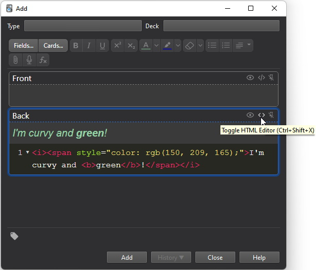

# anki-client-dotnet
 Library for .NET to programatically do things with anki!

## Supported features
 - Adding new cards to deck (including styling!)
 - Retrieving info about decks (deckid)

## Usage
```
using AnkiWeb.Client;
using AnkiWeb.Client.Common.Models;

// Type to handle login credentials.
LoginCredentials loginCredentials = new("test@test.com", "P@ssw0rd123");

// Note: Here the httpClient is new-ed up, but in a real environment the httpClient should be reused. 
HttpClient httpClient = new HttpClient();
AnkiClient ankiClient = new(httpClient, loginCredentials);


// Retrieves info about entire anki collection, including decks, notetypes, ect. 
var myAnkiCollection = await ankiClient.GetCollectionInfoAsync();
var myAnkiDecks = myAnkiCollection.collectionInfo.Decks;


foreach (var deck in myAnkiDecks)
{
    Console.WriteLine($"Deck name: {deck.Name} | Deck id: {deck.Id}");
}
// 'Deck name: Core 2k/6k kanji | Deck id: 1514104708860'
// 'Deck name: Biology memorization | Deck id: 129872109488'

// * Retrieving deck Id is required to add cards to it. *

// As many fields as the type requires is nessesesary even if it's empty. My type has two fields, so I only create two.
List<Field> newCardFields = new()
{
    new Field()
    {
        Name = "Card's front",
        Value = "Moral decay"
    },
    new Field()
    {
        Name = "Card's back",
        Value = "退廃"
    }
};

// Creating a new card to add.
Card newCard = new(
    typeId: "1508585505174",
    fields: newCardFields);

// Trying to add new card.
var result = await ankiClient.AddNewCardToDeckAsync(newCard, "1514104708860");

Console.WriteLine($"{result.Success}. {result.Message}");
// * True. Added new card to deck. *
```

## Styling support
Adding cards containing stylized is supported, and the format requirement is strict.  If the format is wrong, adding a card will fail.

Example of valid stylized text:
```
<i><span style='color: rgb(150, 209, 165);'>I'm curvy and <b>green</b>!</span></i>
```
Easiest way to figure out valid stylized text is to open the card adding interface in Anki desktop application, and toggling the HTML Editor.  This will show valid stylized text, as long as " is replaced with an '. 

